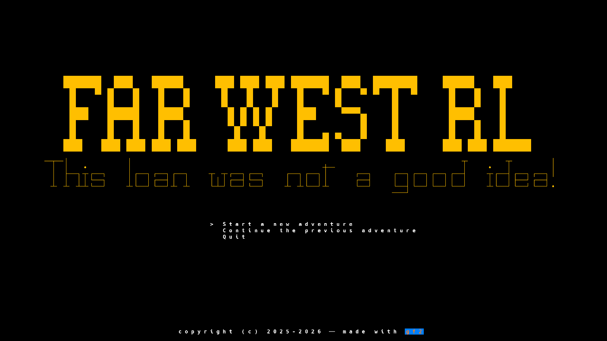

# Far West RL

**Far West RL** is a roguelike set in a world that looks like the 19th century american Far West. It is a traditional ASCII roguelike based on exploration. The plot is simple: the hero owes some money and has escaped in the far far west hoping to hide. But it won't work as expected. The hero has to earn enough money by any means to repay the loan, or escape again in the wild territories.

## Screenshots

Title screen:

